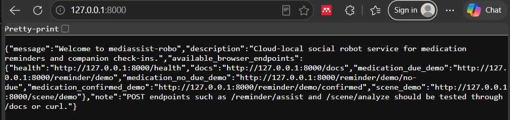
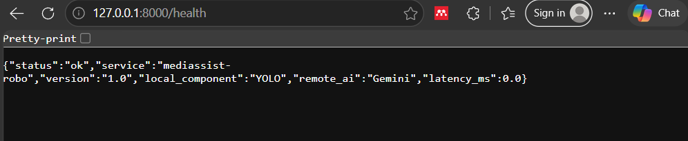
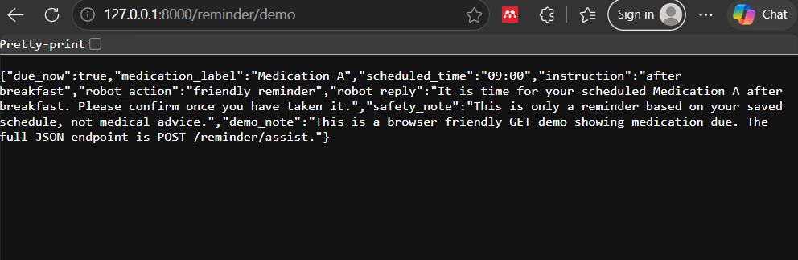
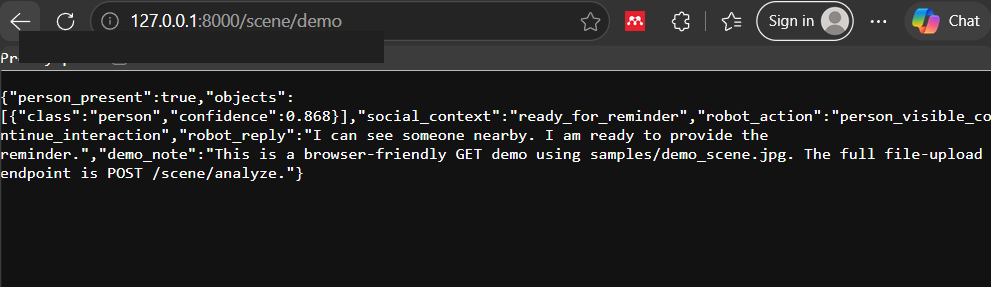
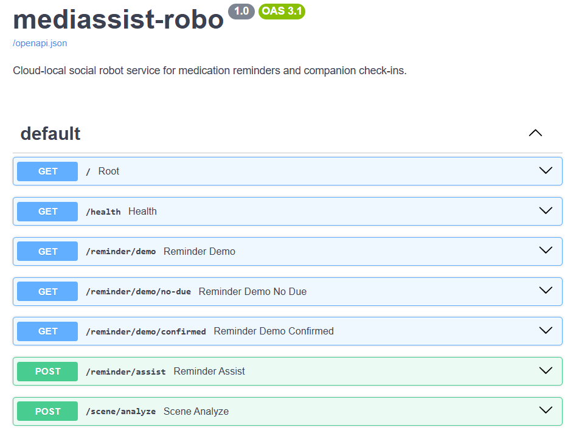
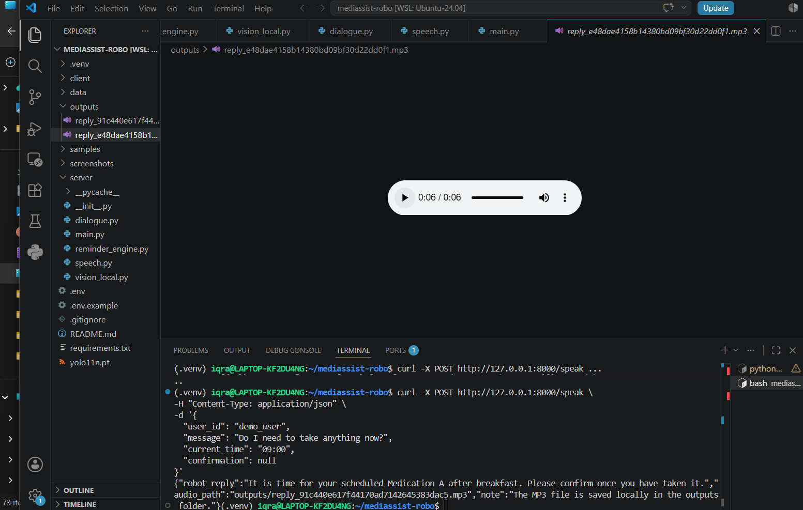
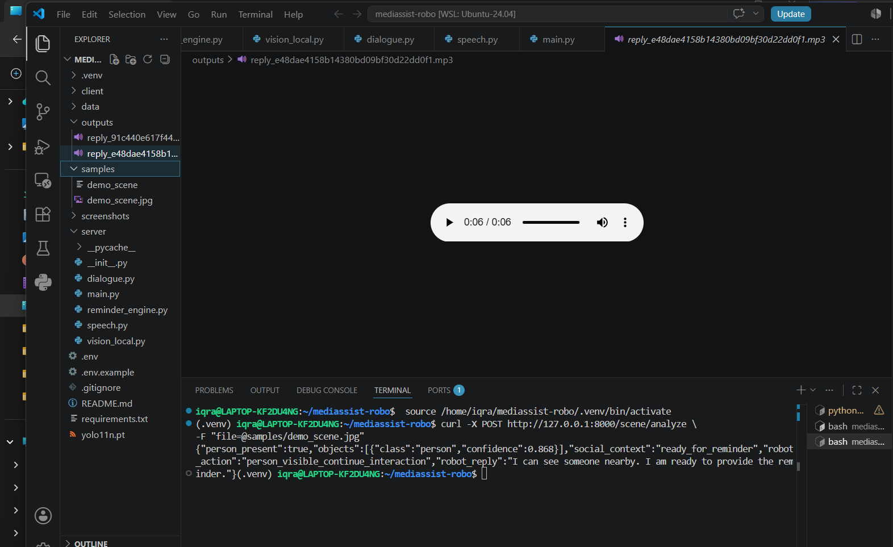
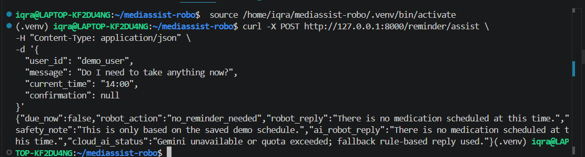

# mediassist-robo

**mediassist-robo** is a cloud-local FastAPI service for a social robot medication reminder and companion check-in assistant. The system allows a lightweight robot client to check a predefined medication schedule, detect whether a person is visible using local vision, generate polite reminder responses, and create a speech output file for social interaction.

This project is designed for the **Cloud Architectures and RESTful Services for Robotics** course final project.

---

## 1. Problem Statement

Social robots can support elderly users, patients, or people living alone by providing friendly medication reminders and companion-style check-ins. However, small robots often have limited onboard computation, battery capacity, and memory. Therefore, this project implements a RESTful backend service where the robot acts as a thin client and sends requests to a FastAPI server. The server handles medication reminder logic, local person detection using YOLO, cloud-based response generation using Gemini with a safe fallback, and text-to-speech output. The system does **not** provide diagnosis, prescription advice, dosage recommendations, or medical decisions. It only reminds the user based on a predefined demo schedule.

---

## 2. Main Features

* FastAPI backend service
* Medication reminder decision engine
* Browser-friendly demo endpoints
* Local YOLO-based person detection
* Gemini cloud AI integration with rule-based fallback
* Text-to-speech response generation using gTTS
* JSON input/output
* Swagger UI documentation
* Safe `.env` handling for API keys
* Suitable for a social robot assistant demo

---

## 3. System Architecture

```text
Social Robot / Client
        |
        | HTTP request: text, image, or reminder query
        v
FastAPI Backend Service
        |
        |-- Reminder Engine
        |     Reads predefined medication schedule
        |     Decides if medication is due
        |
        |-- Local Vision Component
        |     YOLO detects person/object presence
        |
        |-- Cloud AI Component
        |     Gemini generates polite social robot reply
        |     Fallback used if quota/API unavailable
        |
        |-- Speech Component
        |     gTTS creates MP3 voice response
        v
JSON response + optional audio file
```

---

## 4. Course Requirement Checklist

| Requirement              | Implementation                                          |
| ------------------------ | ------------------------------------------------------- |
| FastAPI service          | Implemented in `server/main.py`                         |
| At least 3 endpoints     | Multiple GET and POST endpoints available               |
| JSON input/output        | Used in reminder, health, scene, and speech endpoints   |
| Local component          | YOLO object/person detection                            |
| Remote AI service        | Gemini AI integration with fallback                     |
| Useful robotics scenario | Social robot medication reminder and check-in assistant |
| Safe secrets             | `.env` ignored, `.env.example` provided                 |
| GitHub-ready repository  | Modular code, README, screenshots                       |
| Extra feature            | Text-to-speech using gTTS                               |
| Browser demo             | `/reminder/demo`, `/scene/demo`, `/health`              |

---

## 5. Endpoints

| Method | Endpoint                   | Purpose                                     |
| ------ | -------------------------- | ------------------------------------------- |
| GET    | `/`                        | Home endpoint with useful project links     |
| GET    | `/health`                  | Checks service status                       |
| GET    | `/reminder/demo`           | Browser demo: medication due                |
| GET    | `/reminder/demo/no-due`    | Browser demo: no medication due             |
| GET    | `/reminder/demo/confirmed` | Browser demo: user confirmed medication     |
| POST   | `/reminder/assist`         | Main medication reminder API                |
| POST   | `/scene/analyze`           | Upload image and run local YOLO analysis    |
| GET    | `/scene/demo`              | Browser demo using `samples/demo_scene.jpg` |
| POST   | `/speak`                   | Generate MP3 speech response                |

---

## 6. Project Structure

```text
mediassist-robo/
│
├── server/
│   ├── __init__.py
│   ├── main.py
│   ├── reminder_engine.py
│   ├── vision_local.py
│   ├── dialogue.py
│   └── speech.py
│
├── client/
│   ├── test_health.py
│   ├── test_reminder.py
│   └── test_scene.py
│
├── data/
│   └── demo_schedule.json
│
├── samples/
│   └── demo_scene.jpg
│
├── screenshots/
│
├── outputs/
│
├── .env.example
├── .gitignore
├── requirements.txt
└── README.md
```

---

## 7. Setup Instructions

### 7.1 Open project

```bash
cd ~/mediassist-robo
code .
```

### 7.2 Create and activate virtual environment

```bash
python3 -m venv .venv
source .venv/bin/activate
```

### 7.3 Install dependencies

```bash
pip install --upgrade pip setuptools wheel
pip install -r requirements.txt
```

If installing YOLO/PyTorch manually, use CPU-only PyTorch:

```bash
pip install torch torchvision --index-url https://download.pytorch.org/whl/cpu
pip install ultralytics
```

---

## 8. Environment Variables

Create a `.env` file from `.env.example`:

```bash
cp .env.example .env
```

Example `.env.example`:

```env
GEMINI_API_KEY=your_gemini_api_key_here
OLLAMA_URL=http://127.0.0.1:11434
```

The real `.env` file must not be uploaded to GitHub.

---

## 9. Run the Server

From the project root:

```bash
cd ~/mediassist-robo
source .venv/bin/activate
python -m uvicorn server.main:app --host 0.0.0.0 --port 8000 --reload
```

Open in browser:

```text
http://127.0.0.1:8000/
```

Swagger API documentation:

```text
http://127.0.0.1:8000/docs
```

---

## 10. Browser Demo Links

After starting the server, open:

```text
http://127.0.0.1:8000/
```

```text
http://127.0.0.1:8000/health
```

```text
http://127.0.0.1:8000/reminder/demo
```

```text
http://127.0.0.1:8000/reminder/demo/no-due
```

```text
http://127.0.0.1:8000/reminder/demo/confirmed
```

```text
http://127.0.0.1:8000/scene/demo
```

---

## 11. Example API Tests

### 11.1 Health check

```bash
curl http://127.0.0.1:8000/health
```

Expected output:

```json
{
  "status": "ok",
  "service": "mediassist-robo",
  "version": "1.0",
  "local_component": "YOLO",
  "remote_ai": "Gemini",
  "latency_ms": 0.0
}
```

---

### 11.2 Medication reminder due

```bash
curl -X POST http://127.0.0.1:8000/reminder/assist \
-H "Content-Type: application/json" \
-d '{
  "user_id": "demo_user",
  "message": "Do I need to take anything now?",
  "current_time": "09:00",
  "confirmation": null
}'
```

Example output:

```json
{
  "due_now": true,
  "medication_label": "Medication A",
  "scheduled_time": "09:00",
  "instruction": "after breakfast",
  "robot_action": "friendly_reminder",
  "robot_reply": "It is time for your scheduled Medication A after breakfast. Please confirm once you have taken it.",
  "safety_note": "This is only a reminder based on your saved schedule, not medical advice.",
  "ai_robot_reply": "It is time for your scheduled Medication A after breakfast. Please confirm once you have taken it.",
  "cloud_ai_status": "Gemini unavailable or quota exceeded; fallback rule-based reply used."
}
```

---

### 11.3 Medication not due

```bash
curl -X POST http://127.0.0.1:8000/reminder/assist \
-H "Content-Type: application/json" \
-d '{
  "user_id": "demo_user",
  "message": "Do I need to take anything now?",
  "current_time": "14:00",
  "confirmation": null
}'
```

---

### 11.4 Local YOLO scene analysis

Make sure the file exists:

```bash
ls -lh samples/demo_scene.jpg
```

Then run:

```bash
curl -X POST http://127.0.0.1:8000/scene/analyze \
-F "file=@samples/demo_scene.jpg"
```

Example output:

```json
{
  "person_present": true,
  "objects": [
    {
      "class": "person",
      "confidence": 0.868
    }
  ],
  "social_context": "ready_for_reminder",
  "robot_action": "person_visible_continue_interaction",
  "robot_reply": "I can see someone nearby. I am ready to provide the reminder."
}
```

---

### 11.5 Text-to-speech

```bash
curl -X POST http://127.0.0.1:8000/speak \
-H "Content-Type: application/json" \
-d '{
  "user_id": "demo_user",
  "message": "Do I need to take anything now?",
  "current_time": "09:00",
  "confirmation": null
}'
```

The generated MP3 file is saved inside:

```text
outputs/
```

---

## 12. Demo Medication Schedule

The demo schedule is stored in:

```text
data/demo_schedule.json
```

Example:

```json
{
  "user_id": "demo_user",
  "medications": [
    {
      "label": "Medication A",
      "time": "09:00",
      "instruction": "after breakfast"
    },
    {
      "label": "Medication B",
      "time": "21:00",
      "instruction": "before sleep"
    }
  ]
}
```

Only fake medication labels are used for safety.

---

## 13. Screenshots

The following screenshots show the working FastAPI service, browser demo endpoints, local YOLO vision response, Swagger documentation, and terminal tests.

### Project Home Endpoint



### Health Endpoint



### Medication Reminder Demo



### Local YOLO Scene Demo



### FastAPI Swagger Documentation



### Text-to-Speech Terminal Test



### Local YOLO Image Analysis Terminal Test



### Final Project View



## 14. Safety Boundary

This project is a social robotics prototype for medication reminder support. It does not:

* Diagnose medical conditions
* Prescribe medication
* Change dosage
* Identify real medication from images
* Replace a caregiver, doctor, nurse, or pharmacist
* Make medical decisions

The system only reminds the user based on a predefined schedule.

---

## 15. Known Limitation

The Gemini API may return a quota error if the free quota is exhausted. In that case, the system safely falls back to the rule-based robot reply. This ensures the medication reminder service still works even when the cloud model is unavailable.

---

## 16. Future Improvements

Possible future extensions:

* Add real robot client integration
* Add Groq Whisper speech-to-text for voice input
* Add multilingual responses
* Add caregiver notification
* Add reminder history logging
* Add Tailscale/VPN deployment
* Add HTTPS with nginx reverse proxy
* Add better social dialogue personalization
* Add fall detection or environmental safety alerts, without medical diagnosis

---

## 17. Final Demo Script

A short explanation for presentation:

```text
My project is mediassist-robo, a FastAPI-based cloud-local service for a social robot medication reminder and companion check-in assistant. The robot acts as a lightweight client, while the backend handles medication reminder logic, local YOLO-based person detection, cloud AI response generation with safe fallback, and text-to-speech. The system does not provide medical advice; it only reminds the user based on a predefined schedule. I demonstrate the health endpoint, browser-friendly medication reminder demos, YOLO scene analysis, and speech generation.
```

---

## 18. Run Summary

```bash
cd ~/mediassist-robo
source .venv/bin/activate
python -m uvicorn server.main:app --host 0.0.0.0 --port 8000 --reload
```

Then open:

```text
http://127.0.0.1:8000/docs
```

---

## 19. Release

Create GitHub release tag:

```bash
git tag v1.0
git push origin v1.0
```

---

## 20. License

This project is for academic coursework and demonstration purposes.
